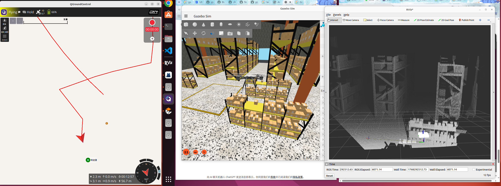
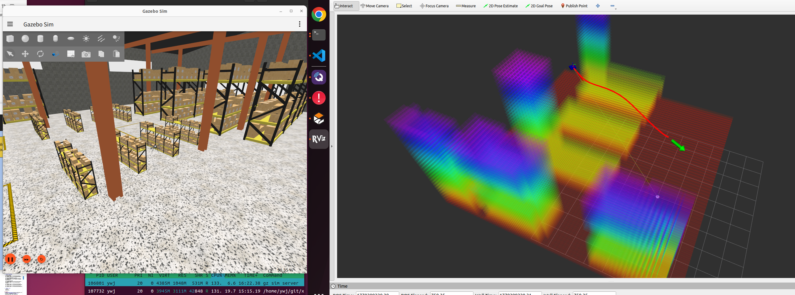
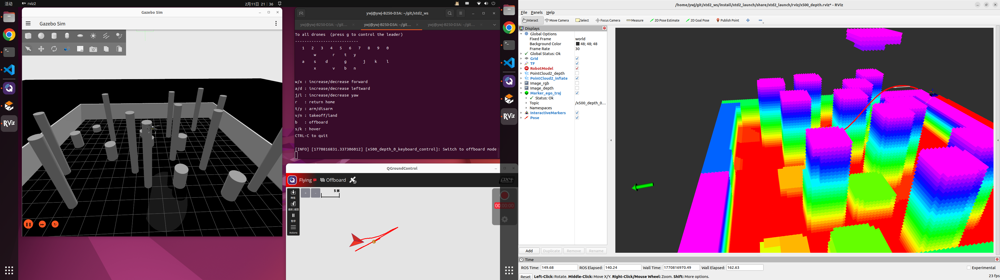

# XTDrone2

## 介绍

XTDrone2是基于PX4、ROS2与Gazebo Ignition的无人机通用仿真平台。

在[XTDrone](https://gitee.com/robin_shaun/XTDrone)的基础上，XTDrone2更新采用了更模块化和轻量化的仿真器Gazebo Ignition；同时由于ROS1版本不再更新维护，XTDrone2将全部基于ROS2进行开发；同时PX4的版本也采用了更新更稳定的1.15版本。

### 最新特性

- **三维定位系统**: 新增基于LiDAR的实时三维定位，支持NDT_OMP配准算法
- **MID360雷达集成**: 仿真飞机集成MID360激光雷达，提升感知能力
- **智能坐标转换**: 改进的TF2坐标转换系统，支持自适应初始朝向
- **PX4启动检测**: 自动检测PX4仿真器启动状态，提升系统稳定性
- **实机适配优化**: 增强对真实无人机平台的支持
- **多机协同**: 支持多无人机协同路径规划

限于开源项目团队人力有限并且为爱发电，过程中难免会存在许多问题，很感激您能够向我们反馈您遇到的BUG或解决方案；过程中遇到的BUG请通过仓库的issue向我们提出，您遇到的问题也可以尝试在issue中先寻求答案。

## 构建项目 / Build Project

### 构建命令
```bash
cd ~/git/xtd2_ws && source install/setup.bash
colcon build --symlink-install --parallel-workers 4   --packages-skip livox_ros_driver2 basic super_lio
source install/setup.bash
```

**注意**: 新增的三维定位系统需要安装额外的依赖：
```bash
# 安装ndt_omp_ros2依赖
sudo apt install ros-humble-pcl-ros ros-humble-tf2-geometry-msgs
```

### 环境配置
在`.bashrc`中添加：
```bash
export RMW_IMPLEMENTATION=rmw_cyclonedds_cpp
source /opt/ros/humble/setup.bash 
cd ~/git/xtd2_ws && source install/setup.bash
export GZ_SIM_RESOURCE_PATH=$GZ_SIM_RESOURCE_PATH:~/.gz/fuel/fuel.ignitionrobotics.org/openrobotics/models:~/.gz/fuel/fuel.gazebosim.org/openrobotics/models
```

### 依赖安装
```bash
# 确保安装gazebo harmonic，并卸载ignition gazebo
sudo apt install ros-humble-tf-transformations 
sudo apt install ros-humble-ros-gzgarden
```

### 清除后台残余
```bash
/home/ywj/git/xtd2_ws/XTDrone2_ego_planner/clear_background.sh
```

### 配置系统权限
```bash
sudo nano /etc/security/limits.conf
# 在文件的末尾（# End of file 之前）添加这几行：

cat   hard    rtprio          99
cat   soft    rtprio          99
cat   hard    memlock         unlimited
cat   soft    memlock         unlimited
```

### 分步启动 / Step-by-Step Launch

#### 1. 基础仿真环境
```bash
# 单独启动雷达建图算法
ros2 launch super_lio Livox_mid360_drone.py

# 完整仿真及真机导航（根据node名称自动判断）
ros2 launch xtd2_launch ros2_single_vehicle_demo_launch.py

# 启动键盘控制
ros2 run xtd2_control multirotor_keyboard_control --model gz_x500_depth --id 0
```

#### 2. 三维定位系统
```bash
# 启动LiDAR三维定位（支持MID360雷达）
ros2 launch lidar_localization_ros2 lidar_localization.launch.py

# 启动RViz可视化定位结果
rviz2 -d $(ros2 pkg prefix lidar_localization_ros2)/share/lidar_localization_ros2/rviz/localization.rviz
```

#### 3. 路径规划系统
```bash
# 单独启动EGO Planner路径规划
ros2 launch xtd2_launch ego_planner_launch.py

# 启动RViz可视化
ros2 launch ego_planner rviz.launch.py

# 发布目标点
ros2 topic pub --once /goal_pose_3d geometry_msgs/msg/PoseStamped '{header: {stamp: now, frame_id: "map"}, pose: {position: {x: 0.0, y: 0.0, z: 0.0}, orientation: {x: 0.0, y: 0.0, z: 0.0, w: 1.0}}}'
```

#### 4. 点云数据
```bash
# 记录点云数据
cd ~/git/xtd2_ws && source install/setup.bash
ros2 bag record -o /home/cat/slam_data/livox_record/ /livox/lidar /livox/imu

# 播放bag
cd ~/git/xtd2_ws && source install/setup.bash
# ros2 bag play /home/cat/slam_data/livox_record/ --clock --loop
ros2 run xtd2_test rosbag_player /home/cat/slam_data/livox_record/livox_record/

# 保存fastlio点云
ros2 service call /map_save std_srvs/srv/Trigger {}
```

### 地面站QGC
```bash
./QGroundControl-x86_64.AppImage
```

### 键盘控制
```bash
ros2 run xtd2_control multirotor_keyboard_control --model gz_x500_depth --id 0
```

### 可视化
```bash
rviz2
```

## 高级功能 / Advanced Features

### 坐标转换系统

XTDrone2改进了坐标转换系统，支持：
- **自适应初始朝向**: 自动适应无人机的初始朝向
- **TF2动态补偿**: 实时补偿PX4坐标系转换
- **多坐标系支持**: 支持世界坐标系、机体坐标系、传感器坐标系

### 实机适配

系统已优化对真实无人机平台的支持：
- **自动主机检测**: 根据主机名自动配置命名空间
- **仿真/实机切换**: 自动识别仿真环境和真实环境
- **传感器配置**: 支持真实LiDAR和IMU传感器集成

### PX4启动检测

新增PX4启动检测功能：
- **自动状态检测**: 检测PX4仿真器启动状态
- **智能重启**: 支持系统重启时的智能组件管理
- **故障恢复**: 自动处理组件启动失败情况

## 飞机单独模拟 / Individual Vehicle Simulation

### 简单启动
```bash
PX4_SIM_MODEL=gz_x500_depth PX4_GZ_WORLD=tugbot_warehouse /home/ywj/git/PX4-Autopilot/build/px4_sitl_default/bin/px4
```

### 详细参数启动
```bash
PX4_UXRCE_DDS_NS=x500_depth_0 PX4_GZ_WORLD=tugbot_warehouse PX4_SYS_AUTOSTART=4002 PX4_SIM_MODEL=x500_depth PX4_GZ_MODEL_POSE='0.0,0.0,0.0,0.0,0.0,0.0' PX4_GZ_MODELS=~/git/PX4-Autopilot/Tools/simulation/gz/models PX4_GZ_WORLDS=~/git/PX4-Autopilot/Tools/simulation/gz/worlds XTD2_GZ_MODELS=/home/ywj/git/xtd2_ws/install/xtd2_gz_sim/share/xtd2_gz_sim/models GZ_SIM_RESOURCE_PATH=$GZ_SIM_RESOURCE_PATH:$PX4_GZ_MODELS:$PX4_GZ_WORLDS:/home/ywj/git/xtd2_ws/install/xtd2_gz_sim/share/xtd2_gz_sim/models ~/git/PX4-Autopilot/build/px4_sitl_default/bin/px4 -d -s ~/git/PX4-Autopilot/build/px4_sitl_default/etc/init.d-posix/rcS ~/git/PX4-Autopilot/ROMFS/px4fmu_common -i 0 -w ~/git/PX4-Autopilot/build/px4_sitl_default
```

## 使用手册和教程文档

详细内容参见[XTDrone2安装教程](https://www.yuque.com/xtdrone/xtdrone2/tutorial)

## 近期更新 / Recent Updates

### 三维定位系统 (3D LiDAR Localization)

XTDrone2新增了基于LiDAR的三维定位系统，支持：
- **NDT_OMP配准算法**: 高性能点云配准与定位
- **多传感器融合**: 支持IMU和里程计数据融合
- **实时路径跟踪**: 提供精确的无人机位姿估计
- **PCD地图支持**: 支持预加载点云地图

启动命令：
```bash
ros2 launch lidar_localization_ros2 lidar_localization.launch.py
```

### 仿真环境增强

- **MID360 LiDAR集成**: 仿真飞机现在集成了MID360激光雷达
- **PX4启动检测**: 自动检测PX4仿真器启动状态
- **坐标转换优化**: 改进的TF2坐标转换系统，支持自适应初始朝向
- **实机适配**: 优化了真实无人机平台的适配配置

### 路径规划系统 / Path Planning

#### EGO Planner 路径规划系统

XTDrone2集成了增强版的EGO Planner路径规划系统，支持：
- **TF2坐标转换**: 自动处理相机到世界坐标系的转换
- **多机协同**: 支持多无人机协同路径规划
- **动态避障**: 实时动态障碍物避让
- **轨迹优化**: 平滑的轨迹生成与优化
- **增强点云处理**: 改进的错误处理和内存优化
- **多无人机支持**: 集群路径规划和协调
- **实时障碍物避让**: 动态环境下的路径重规划

### 功能展示

#### 深度点云可视化


#### 仓库导航


#### 立柱导航


### 近期更新

#### 轨迹优化
- **避免轨迹最后调头**: 实现了轨迹执行完成后直接使用目标点姿态的功能，避免无人机在接近目标点时出现不必要的调头行为。当轨迹执行时间超过`traj_duration_`后，系统会自动切换到使用`/goal_pose_3d`话题中的目标点姿态信息，包括精确的偏航角
- **平滑轨迹过渡**: 改进了轨迹生成和执行逻辑，确保飞行过程更加平稳
- **智能目标点跟踪**: 轨迹服务器会实时监听目标点更新，并在轨迹执行完成后无缝切换到目标点姿态

#### 交互控制
- **RViz交互式控制**: 已完成整体仿真适配，可在RViz中通过拖动箭头标记器控制飞机飞行
- **实时目标设置**: 增强了目标点设置的交互性，支持更直观的飞行控制

#### 传感器融合
- **深度相机用作雷达**: 实现了将深度相机数据转换为雷达点云的功能，扩展了传感器使用场景
- **点云处理优化**: 点云转换逻辑留在gridmap中处理，坐标补偿放到Python端，提高了处理效率

#### 系统集成
- **EGO Planner控制实现**: 已实现EGO Planner与PX4的完整控制集成
- **仿真环境适配**: 添加了ego.sdf模型，完善了仿真环境配置

#### 已知问题
- **PX4 EKF偏差**: 目前PX4的EKF(扩展卡尔曼滤波)存在较大偏差，需要融合odom数据来提高定位精度

#### 快速启动 / Quick Start
```bash
# 启动完整仿真环境（包含EGO Planner）
ros2 launch xtd2_launch ros2_single_vehicle_demo_launch.py

# 或者单独启动EGO Planner
ros2 launch xtd2_launch ego_planner_launch.py
```

#### 参数配置 / Parameter Configuration
EGO Planner支持多种参数配置：
- **namespace**: 无人机命名空间，默认`x500_depth_0`
- **drone_id**: 无人机ID，默认`0`
- **use_sim_time**: 使用仿真时间，默认`true`
- **map_size**: 地图尺寸 (x:200, y:200, z:40)
- **max_vel/max_acc**: 最大速度和加速度限制

#### 高级功能 / Advanced Features
- **坐标系转换**: 自动处理相机坐标系到世界坐标系的转换
- **错误处理**: 增强的点云数据处理和异常处理
- **性能优化**: 内存预分配和TF2缓冲区优化
- **多传感器融合**: 支持深度相机和激光雷达数据

#### RViz可视化 / RViz Visualization
```bash
# 启动RViz查看路径规划结果
ros2 launch ego_planner rviz.launch.py
```

#### 交互式目标设置 / Interactive Goal Setting
EGO Planner包含交互式标记器，允许在RViz中通过拖拽设置目标位置：
- **目标标记**: 在RViz中出现可拖拽的3D标记
- **实时发布**: 拖拽标记时实时发布目标位置到`/goal_pose_3d`话题
- **坐标系**: 基于world坐标系

#### 键盘控制 / Keyboard Control
```bash
# 使用键盘控制无人机飞行
ros2 run xtd2_control multirotor_keyboard_control --model gz_x500_depth --id 0
```

## 坐标系说明 / Coordinate System

### NED 与 FLU 坐标系转换
XTDrone2使用两种坐标系：

#### NED 坐标系 (North-East-Down)
- **X轴**: 指向地理北向
- **Y轴**: 指向地理东向  
- **Z轴**: 指向地心（向下为负）
- **应用**: PX4飞控、GPS导航、外部定位

#### FLU 坐标系 (Forward-Left-Up)
- **X轴**: 指向机体前方
- **Y轴**: 指向机体左侧
- **Z轴**: 指向机体上方
- **应用**: EGO Planner路径规划、传感器数据、内部控制

#### 坐标系对应关系
| FLU坐标系 | NED坐标系 | 转换说明 |
|-----------|-----------|----------|
| X (前向)  | Y (东向)  | X->Y (前向->东向) |
| Y (左向)  | X (北向)  | Y->X (左向->北向) |
| Z (上向)  | -Z (下向) | Z->-Z (上向->下向) |

#### 坐标系转换
轨迹服务器使用ENU（East-North-Up）坐标系，并直接发布到PX4的NED（North-East-Down）坐标系：

**ENU坐标系 (East-North-Up)**
- **X轴**: 指向地理东向
- **Y轴**: 指向地理北向  
- **Z轴**: 指向天顶（向上为正）
- **应用**: 轨迹服务器内部使用

**NED坐标系 (North-East-Down)**
- **X轴**: 指向地理北向
- **Y轴**: 指向地理东向  
- **Z轴**: 指向地心（向下为负）
- **应用**: PX4飞控执行命令

**转换逻辑**:
轨迹服务器在发布命令时会自动处理坐标系转换，确保PX4飞控接收到正确的NED坐标系数据。

#### 实际影响
- **目标点设置**: RViz中设置的目标点使用ENU坐标系（与world坐标系一致）
- **高度显示**: 正值表示向上，负值表示向下
- **路径规划**: EGO Planner在ENU坐标系中规划路径
- **飞控接收**: PX4在NED坐标系中执行命令
- **坐标系一致性**: 轨迹服务器确保所有坐标系转换正确执行

#### 常见问题
1. **高度异常**: 如果无人机高度显示为负值，检查坐标系转换
2. **目标点无效**: 确保RViz中设置的目标点Z值合理（正值向上）
3. **路径规划失败**: 检查地图边界和坐标系设置

#### 验证方法
```bash
# 查看当前坐标系话题
echo /xtdrone2/x500_depth_0/cmd_pose_local_ned
# 检查Z轴数值是否为正值（向上）
```

## 故障排除 / Troubleshooting

### Interactive Marker问题
**问题**: `ModuleNotFoundError: No module named 'interactive_markers'`
**解决**: 文件已重命名为`goal_pose_interactive_marker.py`避免命名冲突

### 路径规划启动失败
**问题**: EGO Planner节点启动失败
**检查**:
1. 确保所有依赖包已正确安装
2. 检查命名空间和话题映射是否正确
3. 验证TF2坐标系配置

### RViz可视化问题
**问题**: 路径规划结果无法在RViz中显示
**解决**:
1. 确认`egoplanner.rviz`文件已正确安装
2. 检查话题名称和坐标系设置
3. 确保点云数据正常发布

### 性能优化建议
- 使用`rmw_cyclonedds_cpp`作为DDS实现
- 适当调整地图大小和分辨率参数
- 在复杂环境中减少点云密度

### 坐标系问题
**问题**: 目标点高度不正确或无人机飞行方向异常
**原因**: NED和FLU坐标系转换错误
**解决**: 
1. 检查轨迹服务器中的坐标系转换逻辑
2. 确认RViz中设置的目标点使用FLU坐标系
3. 验证PX4接收的NED坐标系数据正确

## 使用注意事项

### 环境要求
- **ROS2版本**: Humble Hawksbill
- **Gazebo版本**: Garden (推荐) 或 Harmonic
- **PX4版本**: 1.15.3
- **Python版本**: 3.10+

### 配置要点
1. **PX4目录配置**: 在`xtd2_launch/xtd2_launch/utils/px4_launch.py`第16行配置PX4目录
2. **环境变量**: 确保正确设置所有必要的环境变量
3. **模型路径**: 正确配置Gazebo模型搜索路径

### 常见问题
1. **点云显示异常**: 检查TF关系和相机模型配置
2. **仿真启动失败**: 确认Gazebo版本和模型路径
3. **规划失败**: 检查ego planner参数配置和传感器数据

## 近期重要更新记录

### 2026-02-28 - 系统配置优化与TF修复
**提交**: 多个提交

#### 主要更新内容

##### 1. Launch模块导入问题修复
- **问题**: `setup.py` 中的 `find_packages()` 将 `launch` 目录识别为 Python 包，导致与 ROS2 的 `launch` 模块冲突
- **解决**: 在 `setup.py` 中排除 `launch` 包：
  ```python
  packages=find_packages(exclude=['test', 'launch', 'launch.*'])
  ```
- **影响文件**: `xtd2_launch/setup.py`
- **结果**: 消除了构建时创建的 `launch` 符号链接冲突

##### 2. LaunchConfiguration类型错误修复
- **问题**: `ego_planner_launch.py` 中直接将 `LaunchConfiguration` 对象与字符串相加
  ```python
  # 错误写法
  odom_world_topic = namespace + 'lio/odom'
  
  # 正确写法
  odom_world_topic = [namespace, TextSubstitution(text='lio/odom')]
  ```
- **解决**: 使用 `TextSubstitution` 和列表形式进行字符串拼接
- **影响文件**: `xtd2_launch/launch/ego_planner_launch.py`
- **结果**: 消除了类型不匹配错误

##### 3. use_sim_time动态配置
- **问题**: 所有 launch 文件中硬编码 `use_sim_time=True`，无法在真实环境中使用
- **解决**: 根据主机名自动切换仿真/真实环境配置：
  ```python
  hostname = platform.node()
  if hostname == 'ywj-B250-D3A' or hostname == 'DESKTOP-ypat':
      default_use_sim_time = True   # 仿真环境
  else:
      default_use_sim_time = False  # 真实环境
  ```
- **影响文件**:
  - `xtd2_launch/xtd2_launch/utils/tf_publisher.py` (第33行)
  - `xtd2_launch/launch/ego_planner_launch.py` (已支持)
  - `xtd2_launch/launch/launch_robot_state_publisher.py` (新增)
  - `xtd2_launch/launch/launch_rviz_demo.py` (新增)
- **结果**: 系统现在支持根据主机名自动使用仿真时间或系统时间

##### 4. TF变换重复错误修复
- **问题**: 真实环境（namespace为空）时，`odom -> odom` 变换重复，导致 TF 错误：
  ```
  TF_SELF_TRANSFORM: Ignoring transform from authority "Authority undetectable" 
  with frame_id and child_frame_id "odom" because they are the same
  ```
- **解决**: 在 `tf_publisher.py` 中添加条件判断，只在有命名空间时发布 `odom -> namespace/odom` 变换：
  ```python
  # map -> odom (总是发布)
  t.header.frame_id = 'map'
  t.child_frame_id = 'odom'
  
  # odom -> namespace/odom (只在有命名空间时发布)
  if self.namespace and self.namespace != '/':
      t.header.frame_id = 'odom'
      t.child_frame_id = self.namespace.lstrip('/') + 'odom'
  ```
- **影响文件**: `xtd2_launch/xtd2_launch/utils/tf_publisher.py`
- **结果**: 消除了 TF 变换冲突错误

##### 5. Git仓库地址更新
- **问题**: `ego-planner-swarm` 子模块的 git 仓库地址不正确
- **解决**: 更新为正确的仓库地址：
  ```bash
  git remote set-url origin https://github.com/ypat999/ego-planner-swarm.git
  ```
- **影响目录**: `xtd2_third_party_pkgs/motion_planning/ego-planner-swarm`
- **结果**: 现在可以从正确的仓库获取最新代码

##### 6. 系统服务配置
- **新增**: 为 `ros2_single_vehicle_demo_launch.py` 创建了 systemd 服务配置
- **文件**:
  - `xtd2_launch/scripts/ros2_single_vehicle_demo.service` - systemd 服务配置
  - `xtd2_launch/scripts/start_single_vehicle_demo.sh` - 启动脚本
  - `xtd2_launch/scripts/stop_single_vehicle_demo.sh` - 停止脚本
- **功能**:
  - 自动启动：系统启动后自动运行
  - 自动重启：崩溃后 10 秒自动重启
  - 日志记录：输出到 systemd journal 和日志文件
  - 进程管理：优雅停止所有相关节点

#### 常用指令更新

##### 系统服务管理
```bash
# 安装服务
sudo cp /home/cat/git/xtd2_ws/XTDrone2_ego_planner/xtd2_launch/scripts/ros2_single_vehicle_demo.service /etc/systemd/system/
sudo systemctl daemon-reload
sudo systemctl enable ros2_single_vehicle_demo.service

# 启动/停止服务
sudo systemctl start ros2_single_vehicle_demo.service
sudo systemctl stop ros2_single_vehicle_demo.service
sudo systemctl restart ros2_single_vehicle_demo.service

# 查看服务状态和日志
sudo systemctl status ros2_single_vehicle_demo.service
sudo journalctl -u ros2_single_vehicle_demo -f
```

##### 手动启动脚本
```bash
# 启动单机演示
/home/cat/git/xtd2_ws/XTDrone2_ego_planner/xtd2_launch/scripts/start_single_vehicle_demo.sh

# 停止单机演示
/home/cat/git/xtd2_ws/XTDrone2_ego_planner/xtd2_launch/scripts/stop_single_vehicle_demo.sh
```

##### 环境切换
```bash
# 仿真环境（主机名为 ywj-B250-D3A）
# use_sim_time 自动设置为 True

# 真实环境（其他主机名）
# use_sim_time 自动设置为 False

# 查看当前主机名
hostname

# 查看当前 use_sim_time 配置
ros2 param get /use_sim_time
```

##### Git 子模块管理
```bash
# 更新 ego-planner-swarm 子模块
cd /home/cat/git/xtd2_ws/XTDrone2_ego_planner/xtd2_third_party_pkgs/motion_planning/ego-planner-swarm
git fetch origin
git pull origin main

# 查看子模块状态
git submodule status

# 查看远程仓库地址
git remote -v
```

##### 构建和清理
```bash
# 重新构建 xtd2_launch 包
cd /home/cat/git/xtd2_ws
colcon build --packages-select xtd2_launch

# 清除后台残余进程
/home/cat/git/xtd2_ws/XTDrone2_ego_planner/clear_background.sh

# 查看运行中的 ROS2 节点
ros2 node list

# 查看运行中的话题
ros2 topic list
```

#### 技术改进总结
- ✅ **模块化设计**: 改进了包结构，避免命名冲突
- ✅ **动态配置**: 支持根据环境自动切换配置
- ✅ **错误处理**: 增强了 TF 和坐标系的错误处理
- ✅ **系统集成**: 完善了系统服务管理
- ✅ **版本管理**: 更新了子模块仓库配置

### 2026-01-22 - EGO Planner完整集成和优化
**提交**: [最新提交]

#### 主要更新内容
- **EGO Planner完整集成**: 实现单文件启动完整路径规划仿真环境
- **TF2坐标转换**: 添加自动相机坐标系到世界坐标系转换
- **增强点云处理**: 改进错误处理和内存优化
- **构建系统集成**: 完善rviz配置文件安装和包管理
- **ROS2兼容性**: 优化DDS配置，解决性能问题

#### 技术改进
- 在`ros2_single_vehicle_demo_launch.py`中集成`ego_planner_launch.py`
- 修改`grid_map.cpp`支持TF2坐标转换
- 更新CMakeLists.txt包含rviz文件安装
- 修复interactive marker命名冲突问题
- 完善README文档和使用说明

#### 问题修复
- **Interactive Marker**: 修复了`interactive_markers.py`与ROS2包名冲突导致的循环导入问题
- **文件重命名**: 将`interactive_markers.py`重命名为`goal_pose_interactive_marker.py`
- **API适配**: 更新ROS2 InteractiveMarkerServer的使用方法

### 2026-01-19 - 修复模拟环境问题，换用gz garden
**提交**: c9ace48ccdad2f6b5ca361047d99f6f51ec359f4

#### 主要更新内容
- **模拟环境升级**: 从Ignition Gazebo迁移到Gazebo Garden
- **新增ego_planner启动文件**: 创建完整的ego planner启动配置
- **TF关系优化**: 改进坐标变换发布逻辑
- **PX4启动配置**: 更新PX4启动脚本配置

#### 关键文件修改
- `xtd2_launch/launch/ego_planner_launch.py` - 新增完整的ego planner启动配置
- `xtd2_launch/launch/launch_config/ros_gz_bridge.yaml` - 更新ROS-Gazebo桥接配置
- `xtd2_launch/launch/tf_publisher.py` - 优化TF坐标变换发布
- `xtd2_gz_sim/models/OakD-Lite/model.sdf` - 修复相机模型配置

#### 依赖更新
```bash
# 确保安装Gazebo Garden相关包
sudo apt install ros-humble-ros-gzgarden
sudo apt install ros-humble-tf-transformations
```

### 2026-01-15 - 修正TF关系
**提交**: 10bebd1c39cd965f78f01bba929d3ffe187a9f27

#### 主要改进
- **URDF模型优化**: 修正x500_depth无人机的TF坐标关系
- **坐标变换精度**: 提高传感器和机体坐标变换的准确性
- **可视化一致性**: 确保RViz显示与实际仿真一致

#### 影响范围
- 所有使用x500_depth模型的仿真场景
- 传感器数据与机体坐标的转换精度
- 点云和图像数据的正确显示

### 2026-01-13 - 修正点云显示
**提交**: b50518d2b7f17a7ed3f76040d2b9392539217e84

#### 问题修复
- **点云显示异常**: 修复深度相机点云在RViz中的显示问题
- **模型配置优化**: 改进OakD-Lite相机模型的SDF配置
- **桥接配置更新**: 优化ROS-Gazebo点云数据桥接

#### 技术细节
- 修正了相机坐标系与点云数据的转换关系
- 优化了点云数据的发布频率和质量
- 提高了点云在仿真环境中的可视化效果

### 2026-01-12 - 同步更新
**提交**: e9de8e3

#### 主要内容
- **代码同步**: 保持与主分支的同步更新
- **依赖管理**: 更新项目依赖配置
- **构建优化**: 改进colcon构建配置

### 2026-02-11 - 轨迹优化与交互控制
**提交**: 3c36eaf, 721c135, 6687763, ec58956

#### 主要功能
- **避免轨迹最后调头**: 实现了轨迹执行完成后直接使用目标点姿态的功能，避免无人机在接近目标点时出现不必要的调头行为
- **RViz交互式控制**: 已完成整体仿真适配，可在RViz中通过拖动箭头标记器控制飞机飞行
- **智能目标点跟踪**: 轨迹服务器会实时监听目标点更新，并在轨迹执行完成后无缝切换到目标点姿态
- **平滑轨迹过渡**: 改进了轨迹生成和执行逻辑，确保飞行过程更加平稳

### 2026-02-10 - 传感器融合与点云处理
**提交**: fc97505, 490ffa2

#### 主要功能
- **深度相机用作雷达**: 实现了将深度相机数据转换为雷达点云的功能，扩展了传感器使用场景
- **点云处理优化**: 点云转换逻辑留在gridmap中处理，坐标补偿放到Python端，提高了处理效率
- **仿真环境适配**: 添加了ego.sdf模型，完善了仿真环境配置

### 2026-02-09 - EGO Planner控制实现
**提交**: 4f95499

#### 主要功能
- **EGO Planner控制实现**: 已实现EGO Planner与PX4的完整控制集成
- **系统集成**: 完成了整体仿真适配，可在rviz中拖动箭头控制飞机飞行

#### 已知问题
- **PX4 EKF偏差**: 目前PX4的EKF(扩展卡尔曼滤波)存在较大偏差，需要融合odom数据来提高定位精度

### 2026-01-09 - 基础功能完善
**提交**: 6749e0c, d45ecbf, 60508f5, cdf8daa

#### 主要功能
- **TF发布器**: 实现完整的坐标变换发布系统
- **室内环境**: 添加室内环境模型加载功能
- **启动方式**: 恢复标准的launch文件启动方式
- **仿真对接**: 完成与Gazebo仿真的完整对接

#### 重要说明
- 启动程序应为`gz sim`而非`ign gazebo`
- 需要去除Ignition相关主要组件，保留必要插件
- 确保与ROS2 Humble版本的兼容性

## PX4构建问题修复记录

### 问题描述
在构建PX4 v1.15.3时遇到构建失败，错误信息显示事件系统JSON文件版本不匹配：
```
Traceback (most recent call last):
  File "/home/ywj/git/PX4-Autopilot/src/lib/events/libevents/scripts/combine.py", line 93, in <module>
    main()
  File "/home/ywj/git/PX4-Autopilot/src/lib/events/libevents/scripts/combine.py", line 35, in main
    assert new_events["version"] == 1
AssertionError
```

### 根本原因分析
通过git submodule检查发现，多个子模块使用了比PX4 v1.15.3更新的开发版本，导致版本不兼容：

- `src/lib/events/libevents` - 使用了版本2的JSON格式
- `src/modules/mavlink/mavlink` - 使用了不兼容的开发版本
- `src/drivers/uavcan/libuavcan` - 使用了不兼容的开发版本
- `platforms/nuttx/NuttX/apps` - 使用了不兼容的开发版本
- `platforms/nuttx/NuttX/nuttx` - 使用了不兼容的开发版本

### 解决方案
正确的解决方案是**将子模块恢复到与PX4 v1.15.3兼容的版本**，而不是修改代码来适应不兼容的子模块版本。

#### 修复步骤

1. **检查子模块状态**
   ```bash
   git submodule status
   git submodule foreach 'echo "$name: $(git describe --tags --always 2>/dev/null || echo "No tags") - $(git log --oneline -1)"'
   ```

2. **恢复不兼容的子模块**
   ```bash
   # 修复events子模块
   git submodule deinit -f src/lib/events/libevents
   git submodule update --init src/lib/events/libevents
   
   # 修复mavlink子模块（需要递归初始化）
   git submodule deinit -f src/modules/mavlink/mavlink
   git submodule update --init --recursive src/modules/mavlink/mavlink
   
   # 修复其他不兼容的子模块
   git submodule deinit -f src/drivers/uavcan/libuavcan
   git submodule update --init src/drivers/uavcan/libuavcan
   
   git submodule deinit -f platforms/nuttx/NuttX/apps
   git submodule update --init platforms/nuttx/NuttX/apps
   
   git submodule deinit -f platforms/nuttx/NuttX/nuttx
   git submodule update --init platforms/nuttx/NuttX/nuttx
   ```

3. **验证修复结果**
   ```bash
   make clean
   make px4_sitl
   ```

### 关键经验
- **不要修改combine.py脚本**来支持版本2，这会破坏版本兼容性
- 正确的做法是**保持子模块与主项目版本的同步**
- 在大型项目中，子模块版本管理非常重要
- 遇到构建问题时，首先检查git submodule状态

### 修复结果
✅ 构建成功 - 所有1029个目标都成功编译完成  
✅ 版本兼容性 - 所有子模块现在都与PX4 v1.15.3版本兼容  
✅ 问题解决 - 原始的错误已经完全消除

## drone_detect模块编译问题修复记录

### 问题描述
在编译XTDrone2项目中的`drone_detect`模块时遇到编译错误：
```
In file included from .../drone_detector.h:26:10: fatal error: cv_bridge/cv_bridge.hpp: 没有那个文件或目录
  26 | #include <cv_bridge/cv_bridge.hpp>
      |          ^~~~~~~~~~~~~~~~~~~~~~~~~
compilation terminated.
```

### 根本原因分析
通过检查发现，问题在于ROS2 Humble版本中`cv_bridge`的头文件路径发生了变化：

- **错误路径**: `cv_bridge/cv_bridge.hpp`
- **正确路径**: `cv_bridge/cv_bridge.h`

在ROS2 Humble中，`cv_bridge`的头文件实际位于：
- `/opt/ros/humble/include/cv_bridge/cv_bridge/cv_bridge.h`
- `/opt/ros/humble/include/cv_bridge/cv_bridge/cv_bridge_export.h`

### 解决方案
修改头文件包含路径，将错误的`.hpp`扩展名改为正确的`.h`扩展名。

#### 修复步骤

1. **定位问题文件**
   ```bash
   # 检查cv_bridge实际头文件位置
   find /opt/ros/humble -name "*cv_bridge*" -type f | grep -E "\.hpp|\.h"
   ```

2. **修改头文件包含**
   在文件 `drone_detector.h` 中：
   ```cpp
   // 错误：
   #include <cv_bridge/cv_bridge.hpp>
   
   // 正确：
   #include <cv_bridge/cv_bridge.h>
   ```

3. **验证修复**
   ```bash
   # 重新编译项目
   colcon build --packages-select drone_detect
   ```

### 关键经验
- **ROS2版本差异**: 不同ROS2版本可能有不同的头文件路径和命名规范
- **头文件检查**: 遇到头文件缺失时，应先检查实际安装路径
- **版本兼容性**: 第三方库在不同ROS2版本中可能有细微差异

### 修复结果
✅ 头文件路径修正 - 正确引用ROS2 Humble版本的cv_bridge头文件  
✅ 编译错误消除 - `drone_detect`模块可以正常编译  
✅ 兼容性保证 - 确保与ROS2 Humble版本的兼容性

## 项目团队

## 贡献者

## 加入我们

## 建立合作