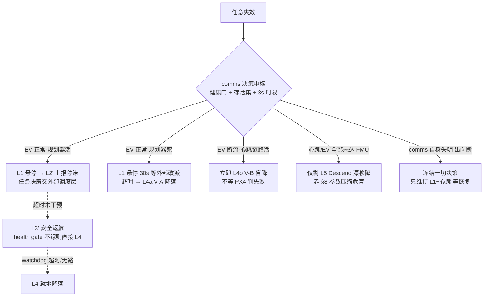

# 系统失效降级方案设计（v0.2，2026-09-18）

> 适用范围：Super-LIO + xtd2_communication + ego_planner/traj_server + uXRCE-DDS + PX4(EV-only) 全链。
> 依据：05_46_38、0914 17:57、0918 13:51 三起事件的复核结论与 `log_345` ULog 实锤。
>
> **前置假设**：本系统之外存在一个**任务调度层**，负责目标点下发
> （发布 `/goal_pose_3d`）与到达确认（外部自行判定）。**该模块本期不动**。
> 本文所有设计以"不侵入、不改变调度层行为"为硬约束，只在其两侧补接口。
>
> v0.2 变更：①goal 遮挡→"可达性微修复（备用点）+上报"设计（§6.1）；②安全返航
> 改为"错误预算触发 + 重放回程（退出机库→主干道→起点）"（§6.2）；③上报通道
> 排查结论与单出口协议（§5.5）；④LIO 双通道检测——"最快切断"与"低敏感"的兼容
> 解（§7），并**修正 §10 关于 RED 停发 EV 的旧表述**；⑤新增无人化隐患清单 H1~H10。

---

## 0. 权限划分：任务权 vs 安全权

| 决策 | 归属 | 说明 |
|---|---|---|
| 去哪个点、顺序、跳过、重试 | **外部调度层** | 系统内不再建 waypoint 队列（上一版方案在此越权，已删） |
| 到达确认 | **外部调度层** | 维持现状；系统只保证"把状态如实报出去" |
| 悬停/跳点停滞的**上报** | 系统（comms） | 只报事实，不替外部做任务决策 |
| 电池红标 / LIO RED / 链路失明 时的**即时保命动作** | **系统本地** | 安全权，不等外部授权（外部响应回路太快不了 3s 时限） |
| 安全动作执行后的**再起飞闸门** | 系统本地（safety_hold） | 防止外部按到达逻辑重发 goal 把已落地的飞机再次拉起 |

原则一句话：**任务问题报告给外部，安全问题自己立即处理并广播**——
两条路的时序要求差两个数量级（任务=分钟级，安全=3 秒级），混在一起会两头误事。

## 1. 三条硬前提（决定"哪些降级存在"）

1. **EV 是唯一绝对定位源 → 悬崖效应**。EV 断流约 4~5s 后 PX4 判
   `local_position_invalid`（0918 ULog 实测），此后 Hold / Position / AUTO_LAND /
   RTL 全部不可运行，飞控端只剩 Descend（无水平控制、随风漂）。
   → **一切"需要位置"的降级动作必须在断流后 ~3s 内决策**，不存在"先等等看"。
2. **PX4 侧 RTL / AUTO_LAND 是够不着的**。无全局定位 → `home_position_invalid`
   实锤。"返航"只能是规划器侧轨迹返航；"降落"分两条腿：位置有效走 AUTO_LAND
   （V-A），位置失效只能自建盲降（V-B）。
3. **comms 是控制链单点**。它死了没有任何外部手段能救（QGC/调度层都无 offboard
   注入通道），兜底只剩 PX4 参数阶梯。因此：comms 自身防护（心跳 try/except、
   EV 限速、BE 订阅——均已落地）和 §8 参数表本身就是降级体系的一部分。

## 2. 降级阶梯（动作定义）

| 层级 | 动作 | 执行者 | 依赖 | 现状 |
|---|---|---|---|---|
| L0 | 带伤续飞（扣帧 / 跳变守卫 / BE 丢过期帧） | comms 守卫 | — | ✅ 已有 |
| L1 | 悬停保持（零速 setpoint 冻结） | comms | 位置有效才站得住 | ✅ 已有（brake/hover） |
| L2' | **goal 停滞上报**（原"跳过点"改造：报告而非决策） | comms → 外部 | — | 🆕 本文 §5/§6.1 |
| L3' | **安全返航**（任务返航归外部，见 §6.2） | planner 通道 + comms | EV+规划器+位置可信 | 🆕 |
| L4a | 原地降落 V-A（AUTO_LAND） | PX4 + comms 监护 | 位置有效 | ✅ `trigger_landing` |
| L4b | 原地盲降 V-B（速度下降 + 触地检测） | comms 直发 setpoint | 仅心跳链路 | 🆕 **全场最值钱** |
| L5 | PX4 failsafe Descend | FMU 自动 | — | ✅（漂移是模式天性） |
| L6 | 触地强制 disarm 1Hz 重试 | comms 降落监护 | 已接地 | ✅ 已有 |

## 3. 核心路由：降级动作取决于"存活集"，而非故障种类



## 4. 失效场景清单 × 检测 × 路由

✅=现有信号可直接用，🆕=需新增（均为 comms/规划侧小改动）。

### A. 感知 / LIO 链

| # | 场景 | 检测 | 路由 |
|---|---|---|---|
| A1 | LiDAR 退化（玻璃/粉尘/特征缺失） | 🆕 协方差贴 `EV_COV_*MAX` 占比、`_odom_reset_out` 速率 | YELLOW→禁返航(转L4)、上报；持续→L3'或L4b |
| A2 | LiDAR 断连/无点云 | ✅ odom `gap>0.3s`；🆕 gap>1s→RED | RED→**L4b（3s 内定夺）** |
| A3 | LIO 发散/跳变 | ✅ `_odom_jump_cnt`；🆕 速率化 N 次/30s | 1~2 次→L1 观察；频发→RED→L4b |
| A4 | LIO 进程死 | ✅ odom 全停 | 同 A2 |
| A5 | 陈旧帧/时标倒退 | ✅ stale 计数；BE 订阅后应趋零 | 成片出现→按 A2 |
| A6 | z 基准污染（baro/测距，0914 前科） | 🆕 PX4 lpos.z 与 LIO z 交叉核对，\|Δ\|>2m 告警 | L1→上报；自动兜底只有 L4b（降速压动能） |

### B. 通信链

| # | 场景 | 检测 | 路由 |
|---|---|---|---|
| B1 | uXRCE 入向断（0918：节点活着在发，FMU 收不到） | 节点**不可自见**→🆕 往返探针：0.5Hz 发幂等 `VEHICLE_CMD_USER_1`，watch `vehicle_command_ack`（✅callback 已有，改接判定） | 探针超时→广播 `LINK_OUTBOUND_DEAD`；机载无法自救→真兜底=§8 的 `COM_OF_LOSS_T=2` + `COM_OBL_RC_ACT`（位置有效→Hold） |
| B2 | agent 崩 | 同 B1 | 同 B1 |
| B3 | 心跳降频（executor 饥饿） | 🆕 自检 timer 实频<10Hz 告警（stats ✅） | 限速已缓解大半；持续→上报，地面改派 L4a |
| B4 | 出向断（FMU→节点，comms"失明"） | 🆕 vehicle_status/vehicle_odometry 到达 watchdog（>2s 无） | **最阴险**（会基于陈旧状态乱动作）→立即冻结决策、只维持 L1+心跳、广播 `LINK_BLIND` |

### C. 规划 / 任务层

| # | 场景 | 检测 | 路由 |
|---|---|---|---|
| C1 | traj_server/planner 死 | ✅ `cmd_trajectory_flu` 断流（8.8Hz 基线） | 位置有效→L1 悬停 30s（等外部改派）→超时 L4a。**绝不自动 V-B**（位置好没必要赌） |
| C2 | goal 不可达/无进展（0918 实况：收 goal 后悬停 56s） | 🆕 goal 进展 watchdog：预算 `T_goal` 内距 goal 距离无净下降 | **L2' 上报 GOAL_STALLED**，任务决策交外部；超时无干预→L3'（安全返航）→L4 |
| C3 | 轨迹求解反复失败 | 🆕 traj_server 失败/时间预算耗尽计数（随 status 带出） | 同 C2 |
| C4 | 坏 goal（越界/地下/超远） | 🆕 comms 入链前合法性检查 | 拒绝+上报 `GOAL_REJECTED`，不触发 auto-switch |
| C5 | 起飞序列卡住（arm/takeoff ack 丢失） | ✅ ack callback 现成，🆕 接超时判定 | 放弃起飞→disarm→IDLE→上报 |

### D. 电源 / 环境 / FMU

| # | 场景 | 检测 | 路由 |
|---|---|---|---|
| D1 | 电量黄（建议返航线） | 🆕 comms 目前**没有** battery 订阅，第一块缺口 | 上报 `BATTERY_WARN`；等外部改派返航，`T_ext` 无干预→本地 L3' |
| D2 | 电量红（保底线）/电压急坠 | 🆕 阈值+下降速率 | 不等外部：L4a（位置有效）/L4b（临界） |
| D3 | 板卡过热 | ✅ >86°C 已有降落 | 已有 |
| D4 | FMU 空中重启（brownout/hardfault） | **软件无解**（0526 类） | 只能硬件缓解（飞控独立供电/大容量电容）；如实标注 |
| D5 | IMU/执行器失效 | FMU failure_detector 自理 | 不介入 |

### G. 人工阀

| # | 场景 | 问题 | 建议 |
|---|---|---|---|
| G1 | 无人工接管通道 | `COM_RC_IN_MODE=3` 禁摇杆，QGC 又被 offboard 链路牵制 | RC 三段开关→DDS 转发进现有 command service：HOVER / LAND（kill 慎用）。属本机自身改动，不涉调度层 |

## 5. 与外部调度层的接口契约（本期新增的唯一"协议面"）

外部调度层**零改动**也可运行（它继续发 `/goal_pose_3d`、按自己的方式确认到达）；
以下接口是**系统单方面广播**，外部将来按需接入即可。

### 5.1 `goal_seq`（目标代次）
comms 每收到一个新 `/goal_pose_3d`，`goal_seq += 1`（本机打戳，不改外部消息）。
所有状态上报携带 `goal_seq`，外部可用它对齐"我说的是哪一个目标的事"。

### 5.2 `/mission_status`（`std_msgs/msg/String`，JSON，1Hz+事件即发）

```json
{
  "goal_seq": 12,
  "state": "EXEC | HOVER | STALLED | RETURNING | LANDING_VA | LANDING_VB |
            LANDED | SAFETY_HOLD | LINK_BLIND | LINK_OUTBOUND_DEAD | IDLE",
  "reason": "GOAL_NO_PROGRESS_90S | BATTERY_WARN | LIO_RED | PLANNER_DEAD | ...",
  "dist_goal": 4.21,
  "alt": 4.14,
  "battery": {"pct": 31.2, "warn": false},
  "lio": "GREEN | YELLOW | RED",
  "ts": 1789710709.1
}
```
- 状态变化立即发布；稳态 1Hz 心跳式（外部可用来检测 comms 存活）。
- **`state` 是全序的**：外部若只订阅这一个 topic 即可看懂飞机在干什么。

### 5.3 `safety_hold` 再起飞闸门（头号协作风险的解）
现状：任何 `/goal_pose_3d` 会走 auto arm→takeoff→offboard 全自动。
若系统本地执行了 L3'/L4（安全返航/降落）而外部按原到达逻辑重发下一个 goal，
**会把已落地的飞机再次拉起**。规则：

1. 任何**本地安全动作**（L3'/L4a/L4b/B1~B4 触发）一旦执行 → `safety_hold=True`；
2. hold 期间：goal 到达一律**不转发 planner、不触发 auto-switch**，只回
   `SAFETY_HOLD` 状态（外加一条显式拒绝日志）；
3. 解除条件（二选一）：
   - 外部干预：调用现有 command service 新增的 `RESET_HOLD`（或后续外部接
     status 后按其节奏确认）；
   - 飞机已 disarm 且人工重启节点（保底路径，不依赖外部）。
4. **任务类上报（GOAL_STALLED 等）不进 hold**——那是给外部决策的信息，
   外部改派新 goal 时按正常流程走（自动清 hold 不适用，本来就无 hold）。

### 5.4 宽限期 `T_ext`（安全动作等不等外部）
- 电量黄、goal 停滞：**先上报，等 `T_ext=30s`**（可参）无新 goal/无干预 → 本地
  安全动作接管（L3'→L4）。
- LIO RED、电量红、触地前兆：**不等**，立即执行。3 秒时限来自 §1.1，物理性质，
  协议改不了。

### 5.5 上报通道排查结论（"现有 topic 有没有可复用的"）
**结论：没有现成通用问题上报通道**，逐项核查（2026-09-18）：

| 现有 topic / 消息 | 判定 |
|---|---|
| `<ns>/planning/data_display`（`DataDisp`） | ❌ 本 fork 已退化为 `header + 5×float(a..e)` 空壳，字段无语义约定，塞状态会成黑盒 |
| `<ns>/planning/bspline`（`Bspline`） | ⚠️ 只可作"规划器有输出"的**侧信号**（bspline 停发=规划断产），由 comms 内部消费，不适合给外部当问题通道 |
| `/debug_info`（drone_detect，String） | ❌ 单机避障专用，语义被占 |
| `debug/vehicle_state`（XTD2VehicleState） | ❌ xtdrone 调试工具私有面，消息重、含 sim 语义 |
| `/pcl_pose`、`/map_odom_pose`、`/initialpose` | 位置源，外部层大概率已在用（到达确认），不是问题通道 |
| `/stop_planning`（Empty） | ❌ 系统内部协定，布尔语义 |

**方案：单出口协议**（外部只对接 comms 一个节点）：
- `/mission_status`：String+JSON（§5.2），1Hz 稳态 + 状态变化即发——兼作
  **comms 自身心跳**（外部以"status 断流 3s = 机载失联"作判据，见 H8）；
- `/mission_event`：String+JSON，一次性事件流水
  （`GOAL_SUBSTITUTED / GOAL_UNREACHABLE / RETURN_INIT / RETURNED_LANDED /
  LIO_RED / LINK_OUTBOUND_DEAD / LINK_BLIND / BATTERY_* / NOT_READY …`），
  带 `goal_seq` 与上下文；
- planner 问题不直面外部：traj_server 新增 `/planner_diag`（String+JSON：
  stalled / solve_fail_count / unblock 结果），**comms 订阅后归并**进上面两路——
  避免双出口造成外部看到互相矛盾的状态；
- 待谈协议项（外部后续接入时对齐，不阻塞本期开发）：
  - **P-A**：`GOAL_SUBSTITUTED` 的到达语义（G' 算不算到达、到达容差多少）；
  - **P-B**：`/mission_lease` 租约（H2，外部周期续租，机载超时→任务暂停链）；
  - **P-C**：`RETURNED_LANDED` 后由外部程序自动发 `RESET_HOLD`（无人化收口）。

## 6. 三大动作具体设计（修订版）

### 6.1 goal 停滞 → **可达性微修复（备用点）→ 上报（L2'）→ 安全接管**
- 权限切分（回应"航点被遮挡"）：**任务顺序取舍归外部（跳过与否），"怎样到达这个点"
  属执行细节归内层（备用点微修复）**。系统内仍不建 waypoint 队列。
- 三级链路：
  1. **停滞检测**：comms 的 goal 进展 watchdog（`T_goal` 默认 90s，`dist(goal)` 无
     净下降；用 LIO 速度区分"卡住"与"已到达未确认"——`dist<0.5m` 时只报
     `ARRIVED_UNACK`，**永不自行离场**，到达点附近乱动最危险）。
  2. **可达性微修复（备用点，traj_server 侧）**：goal 被遮挡本质是"终点落在
     occupied 区内或其背后"。以原 goal 为心做**极网格搜索**
     （r ∈ {0.3,0.6,1.0,1.5}m × 8 方位，≤32 格），判据 = grid_map free +
     垂直净空 + 短程 A* 可达；取距原点最近者作 G'。找到 → 飞向 G'，同时上报
     `GOAL_SUBSTITUTED {orig, used, dist}`——**G' 算不算"到达"由外部定**
     （协议待谈项 P-A，见 §5.5；外部未接入前，替代行为照常执行并广播）。
     全部格失败 → 第 3 级。
  3. **上报 + 宽限 + 安全链**：`GOAL_UNREACHABLE`（附候选格列表与占用快照摘要，
     外部改派时有依据）→ L1 悬停 → `T_ext=30s` 无干预 → L3' 安全返航 → 必要时 L4。
- 与 0918 实况的对照："收 goal 后悬停 56s、后续悬到没电"在 v0.2 链路上变成
  **≤ 90s 内要么替代到达、要么带原因上报并转入返航/降落安全链**——不存在
  "耗到没电"这个结局。

### 6.2 安全返航（L3'）：错误预算触发 + 重放回程
- **触发条件（回应"多次出错自动返航"）= 错误预算**：单机时累计、只增不减，
  任一项达上限即 `RETURN_INIT`（任务级降级；电量红/LIO RED 属**即时安全动作**，
  不走预算）：

  | 事件 | 计权 | 单项上限 |
  |---|---|---|
  | `GOAL_UNREACHABLE`（含 §6.1 微修复失败） | 3 | 2 |
  | goal 停滞上报后超 `T_ext` 无干预 | 2 | 2 |
  | LIO YELLOW  episode | 2 | 3 |
  | 链路抖动（B1 探针超时 / B3 降频 / B4 失明） | 2 | 3 |
  | planner/traj_server 异常重启 | 3 | 1 |
  | 电量黄 | — | 直接触发，不记分 |
  总分（Σ权值）≥ 6 同样 `RETURN_INIT`。预算随 flight 复位（落地 disarm 清零）。

- **航路 = "重放回程"（breadcrumbs，默认实现）**：这恰好天然满足
  "先推出机库 → 飞到主干道 → 再回起点"——去程本来就是从机库沿主干道进来的，
  倒放即航路约束，无需部署路网、无需语义标注：
  1. 自 takeoff 完成起，按 0.5~1m 步距记录降采样轨迹，**只存 LIO/odom 系**
     （返航用同一 frame，绝对漂移在同帧回放中自然对消——这是重放法优于
     "预设 map 系航点"的关键性质）；
  2. 返航 = 从当前位置就近接入轨迹、倒序作为内部 goal 序列喂 traj_server；
     主干道约束是"提示"不是"硬轨"——planner 局部避障照常工作（途中可能多了新障碍）；
  3. **段级 watchdog**：单段无进展超时 → 按 §6.1 微修复重试 1 次 → 仍失败 →
     就近落"安全区"（H4 迫降点库），不再硬推返航；
  4. 硬前提：health gate GREEN + **距离感知能量检查**（剩余回放路径长 × 消耗系数
     < 电量余量，H7）——不够就就近降落，不返航。
- **Phase 2（本期不做）**：部署成熟后可配"官方返航航路"（map 系主干道航点序列）
  覆盖重放法；两者接口一致（goal 序列输入）。
- **机库端收口**：home（机库上方）到位 → 落地点净空核验（H3 多源触地判定）→
  L4a/L4b 着陆 → 上报 `RETURNED_LANDED` + `safety_hold`。**对接桩/充电归外部**；
  hold 的自动解除走 §5.3：外部消费 `RETURNED_LANDED` 后由**程序**发 `RESET_HOLD`
  （无人站无需人到场）。
- 不变项：home 快照于 auto_switch 完成时刻；**禁用
  `VEHICLE_CMD_NAV_RETURN_TO_LAUNCH`**（现有 `rtl()` 改绑为本节实现或删除——
  无 global/home 的机上下发 RTL = 虚假安全感）。

### 6.3 原地降落（L4）—— V-A 已有，**V-B 盲降新建**
- **V-A（位置有效）**：现成 `trigger_landing()`→AUTO_LAND→既有降落监护。不动。
- **V-B（EV 已死/将死、心跳链路活）状态机 `LAND_IN_PLACE`**：
  1. 进入条件：§7 **快通道事件**确认 RED（odom 全停>1s / NaN 协方差 / 时标倒退 /
     连跳 2 次）；或 C1/B4 的"位置尚有效但等待放弃"超时后**降级进入**
     （若届时位置仍有效则优先走 V-A）。
  2. **同一拍内先停发 EV**（§7 RED 序列），心跳切 velocity=True，
     `velocity=[0,0,0]` 悬停 2s（趁 PX4 lpos 未判死，还站得住）。
  3. 混合 setpoint：`position=[x,y,*]`（锁最后水平位置）+ `velocity_z=+0.4m/s`
     （NED 下正）下降；**心跳全程保持**，避免 PX4 抢先 offboard-loss→Descend。
  4. 触地判定：**多源投票（H3）**——baro 高下降率归零 + 垂直速度≈0 + 测距触地，
     三取二才认可（0914 测距虚假归零 = 空中关车的前科，V-B 阶段这条最致命）。
  5. 触地后：`OFFBOARD_STATE=DISABLED` + `LANDING_VB→LANDED` 上报 + 既有
     1Hz 强制 disarm 兜底 + `safety_hold=True`。
- 承认的风险：盲降对脚下无障碍感知；0.4m/s 限速压动能；**只应在已知净空区
  （重放回程沿途/主干道/机库前，即 H4 安全区）信任它**，这是它排在 V-A 之后的原因。
- **时序锚点（v0.2 修正旧表述）**：V-B 与"停发 EV"同拍启动，与 §1.1 的
  4.5s 失效窗口赛跑；竞速失败（EKF 先判 invalid）→ L5 Descend 自动接管
  （baro 保高度、XY 漂移），这不是设计缺陷而是档位边界——机载软件在
  "位置已死+心跳将死"象限里没有更高等级可做了。

## 7. LIO health gate：双通道设计（"最快切断"与"不能高敏感"的兼容解）

矛盾点：真发散时要**最快**切断降级，但 LIO 真故障概率很低，**连续统计型敏感
检测必然误伤**（误切断=把好着的飞行自己搞成事故）。解法 = 快慢两个通道用
**性质不同的信号源**，各管各的：

- **快通道（→RED，确认窗口 ≤0.5s，一票否决）**：只收"必坏物理事件"，
  不收统计解释——

  | 事件 | 为什么它是"必坏"而非"看着坏" |
  |---|---|
  | odom 全停 >1s | 进程/驱动级停止，无解释空间 |
  | sanitize 计到 NaN/Inf 协方差（`_cov_bad_cnt` 增量） | ESKF 求逆已发散（0914 前科），此值本不该存在 |
  | 消息时标倒退 / 单步跳变 >1s | 时钟或内部状态坏，非环境所致 |
  | 跳变守卫**连续 2 次** | 估计器在瞬移而非漂移（单次可能是传输毛刺） |

  这些判据本身就是"这一帧必为垃圾"级别的确定事实，误报率≈0，所以窗口可以
  压到 0.5s 而不扰民。**协方差趋势斜率、创新统计、滑窗均值一类"趋势检测"
  明确不进快通道**（那是高误伤的源头）。
- **慢通道（→YELLOW，只限任务、零动作）**：单帧 stale、单次跳变、协方差短时
  贴顶、z 交叉核对差、匹配健康度下降…→ 上报 + 禁返航 + 计入错误预算（§6.2），
  **永不直接切断**。
- **RED 动作序列（v0.2 修正，与 §6.3 对齐）**：
  1. **立即停发 EV**（本函数直接 return，连 NaN 都不用发）——RED 的语义已是
     "这路输出不可信"，继续发 = 把发散值灌给 EKF（0914 的 xy_reset 风暴前科）;
  2. 心跳切 velocity=True + 零速，同拍启动 V-B，在 ~4.5s 失效窗口内完成
     悬停→下降（§1.1/§6.3 的赛跑）；
  3. 上报 `LIO_RED {trigger_event}` + safety_hold。
  "最快切断"的准确含义 = **0.5s 判定 + 4.5s 落地竞速**，而不是"检测更灵敏"。
  RED 为单向闩锁（本 flight 内不回退），杜绝抖动反复。
- 低概率≠低处置：正因为真发散罕见，快通道阈值可以设得只认"必坏"——罕见的
  确定事件不需要统计放大器。

## 8. PX4 参数兜底（与软件层并列，缺一不可）

| 参数 | 现值 | 建议 | 理由 |
|---|---|---|---|
| `COM_OF_LOSS_T` | **60** | 2 | log_345 实锤：心跳断供 60s 才判 lost，全靠 position invalid 连带触发（+4.5s）。位置有效时的断链（如 B1 变体）会挂 60 秒 |
| `COM_OBL_RC_ACT` | 4 | 位置可保持类动作（Hold/Position） | 入向断时飞控端唯一自动防线；本机 Hold 不可用时 PX4 自动逐级 fallback，配它不亏 |
| `COM_QC_ACT` / `COM_FLTT_LOW_ACT` | Return 系 | Land | 无全局定位，Return 永不可达（§16 H3 旧结论） |
| `MPC_Z_VEL_MAX_DN` | 1.0 | 0.7 | 压低 L5 漂移下降动能 |
| `EKF2_EV_* / OF / GPS` | 已定档 | 维持 | 0918 证明参数体系无罪 |

## 9. 实施顺序（含验收）

| 阶段 | 内容 | 主要落点 | 验收 |
|---|---|---|---|
| P0 | §8 参数 | QGC | 台架拔线测试：位置有效时断心跳 ≤3s 进 Hold |
| P1 | V-B 盲降（含多源触地判定 H3）+ safety_hold + `goal_seq` + `/mission_status`/`/mission_event` 骨架 | comms 单文件 | 系绳台：手动杀 LIO → ≤3.5s 进 V-B 受控落地；hold 挡住 goal 重发；status 1Hz 可订阅 |
| P2 | battery 订阅 + 黄/红阈值 + 距离感知能量（H7 简版：home 距离×系数） | comms | 回放/实拔验证两档 |
| P3 | health gate 双通道（§7）：快通道"必坏"事件 + RED 停发 EV 序列；慢通道 YELLOW 计数入预算 | comms | 台架注入：kill LIO 进程/伪造 NaN 协方差 → ≤0.5s RED；单帧毛刺 → 仅 YELLOW |
| P4 | goal 进展 watchdog + 备用点微修复（§6.1 极网格）+ `/planner_diag` | traj_server + comms | 复演 0918"悬停 56s"：遮挡 goal 下 ≤90s 内出现 GOAL_SUBSTITUTED 或 UNREACHABLE 上报 |
| P5 | 错误预算（§6.2 表）+ 重放回程记录/倒放 + 段级 watchdog + `RETURNED_LANDED` | traj_server + comms | 场地：中段杀规划器/连错 2 个 goal → 自动沿去程轨迹退回机库并降落 |
| P6 | B1 往返探针 + B4 失明 watchdog + G1 RC 阀 | comms | 断 agent：广播 `LINK_OUTBOUND_DEAD`；断出向：节点冻结不乱动 |
| P7 | pre-flight READY gate（H1）+ `/mission_lease` 机载侧超时（H2/P-B）+ 日志/磁盘水位（H6，含关 PCD 写盘） | comms + launch 配置 | 未收敛时 goal 被拒并 NOT_READY 上报；lease 断 10s 自动走 §5.4 链 |
| P8 | 迫降安全区数据模型（H4，先支持手工配置 json）+ 状态机振荡审计（H5 逐条走查） | 配置 + comms | 评审：每个自动动作都有预算与最低代价收敛出口 |
| P9 | 归档/迭代 | 本文 | — |

P1 是安全净收益最大的一步（覆盖 A2/A3/A4/D2 四类高频场景的受控落地），
P4/P5 是协作正确性的关键（0918 的"悬停 56s 无事发生"暴露的正是上报缺失）。

## 10. 明确不做 / 边界

1. **不动外部调度层**：不替它做跳过/重试/到达判定；只广播状态供其消费。
   （备用点微修复属"到达该点的执行方式"，不是任务取舍，见 §6.1 权限切分；
   其到达语义由协议项 P-A 与外部对齐。）
2. **系统内不建 waypoint 队列**（与调度层职责重复）。
3. **不使用 PX4 RTL / 不假装可达 AUTO_RTL**；`rtl()` 待改绑或删除。
4. **EV 关通道时机（v0.2 修正）**：YELLOW **绝不**停发/关 EV——位置仍可信时
   主动引爆 invalid 等于自杀（§1.1 的 3s 窗口会瞬间清零）；RED（快通道
   "必坏"事件确认后）**必须同拍停发 EV**——此时继续转发才是投毒（0914 前科）。
   两档动作完全相反，以 §7 的事件性质为唯一分界，不存在"看情况关"。
5. **FMU 空中重启软件不可救**（D4），归硬件整改。
6. 不引入新 msg 包：上报全部 `std_msgs/String`+JSON，接口最小化。
7. **不做统计趋势型自动切断**（协方差斜率/创新滑窗类）——趋势信号只入
   慢通道（YELLOW/预算），动作权严格保留给"必坏"事件。

## 11. 下次飞行核对清单（ULog + 节点日志）

- [ ] `vehicle_visual_odometry` 入流 ≈20Hz、无 >0.2s 空洞（EV 限速已生效）
- [ ] `timesync_status` 1Hz 全程不中断（入向链路健康）
- [ ] 节点 stats：`ros2_odom_callback` avg_time 显著低于 6.2ms、timer 恢复 20Hz
- [ ] `/mission_status` 1Hz 可达（`ros2 topic echo`）
- [ ] 若再现 GOAL_STALLED：确认外部调度层在 T_ext 内的响应行为符合预期
- [ ] `COM_OF_LOSS_T`/`COM_QC_ACT` 生效值复核（parameter_update 快照）

## 12. 无人化补充隐患清单（v0.2 新增——"现场没遇到过"≠"不存在"）

目的对齐：**在确保安全的前提下最小化人员介入**。以下每条都是"无人值守时
才会咬人"的类别，H3/H6/H7 已被历史事件间接证实。

| # | 隐患 | 后果 | 对策（挂靠节） |
|---|---|---|---|
| H1 | **开机无自检闸门**：节点乱序拉起，LIO 未收敛/地图未加载时 goal 照样触发 auto arm | 带病起飞 | pre-flight READY gate：LIO 新鲜+协方差、地图匹配收敛、PX4 往返、电量/温度、磁盘水位全绿才 READY，否则拒 goal 上报 `NOT_READY{missing}`（P7）。这也是把"到场人员"变"远程重启"的前提 |
| H2 | **外部调度层自身死掉**：没人下发/确认 | 飞机空中死等 | 双向租约：外部周期发 `/mission_lease`，机载超时→L1→L3'→L4（P-B 协议项）。无人化闭环必须双向心跳，单方上报不够 |
| H3 | **触地判定单源**：测距超量程虚假归零（0914 前科）→ 假接地 → COM_DISARM_LAND → 空中关车 | 高处自由落体 | 触地三取二投票（baro 率归零+vz≈0+测距），接入所有降落路径与 V-B（§6.3.4，P1） |
| H4 | **返航失败没有"第二降落场"**：途中路被占/段卡死 | 耗到没电随机迫降 | 安全区库（部署资产 json）：主干道节点/机库前净空点；返航段失败→就近安全区；没有库数据时默认低速盲降并如实标注风险（P8） |
| H5 | **软件环拍**：同一故障上 跳过→返航→再起飞 循环 | 行为不可预测 | 每个自动动作带重试预算、耗尽只收敛到 {悬停,降落,上报} 三出口；RED/hold 单向闩锁（P8 审计） |
| H6 | **日志/磁盘水位**：journal 满/慢盘 IO 阻塞 rclpy（0918 的 31s 停顿嫌疑之一）；super_lio 每 5s 写 PCD 属调试行为 | 链路级卡死、随机停顿 | 磁盘水位自检入 READY gate 与慢通道；journald 限速轮转；**生产模式默认关 PCD 写盘**（P7） |
| H7 | **电量阈值不感知距离**：远端点 30% 够近端点不够（或反） | 想返航时电已不够 | 距离感知：剩余返航路径（重放轨迹长度）×消耗系数 对比余量，不满足→就近降落而非返航（P2/P5） |
| H8 | **失声即故障**：comms 崩/DDS 挂，外部无感知途径 | 无人站失去决策依据 | `/mission_status` 1Hz 兼 comms 心跳，外部"断流 3s=失联"自走其安全流程；机载侧 offboard-loss 阶梯照常兜底（§8） |
| H9 | **环境慢漂移**：货架挪动、LiDAR 窗脏（灰尘/水雾→点云密度骤降） | 定位质量渐进劣化后突然 RED | 匹配分数/点云密度趋势只进慢通道，超阈值报 `MAINTENANCE_HINT`——无人化的"少人介入"包含"把人叫在故障之前而不是之后" |
| H10 | **时基未闭环**：S10（EV timestamp=ROS epoch µs vs 飞控 boot µs）仍"待核实"；现场 NTP 跳变 | 时间戳判定链整体失效（stale/gap/快通道全靠它） | 真机一次 `listener vehicle_visual_odometry` 闭环 S10；comms 加时标单调性自检（快通道项）；chrony/时区写入部署基线 |
| H11 | **多机/多站点同域**：DDS domain 复用、地图版本与场地不匹配 | 双头控制/异图定位 | 每场地 domain id/namespace/地图指纹三元组核对，入 READY gate（场地扩展前必做） |

## 13. 版本与讨论状态

- v0.2（本版）：吸收用户反馈四题（遮挡备用点 / 错误预算+机库-主干道-起点返航 /
  上报通道排查 / LIO 快速但低敏）+ 隐患清单 H1~H11。
- 待外部调度层对齐项汇总：P-A（替代点到达语义）、P-B（租约）、P-C（自动解除
  hold）、H4（安全区库由谁维护）。**本期开发不阻塞于这四项**——机载侧全部
  行为默认自洽，外部接入只是"从广播里受益"。
- 下一版触发条件：P1~P4 落地后回填实测参数（`T_goal/T_ext`、快通道事件真
  阳性统计）、或新事故复盘。
