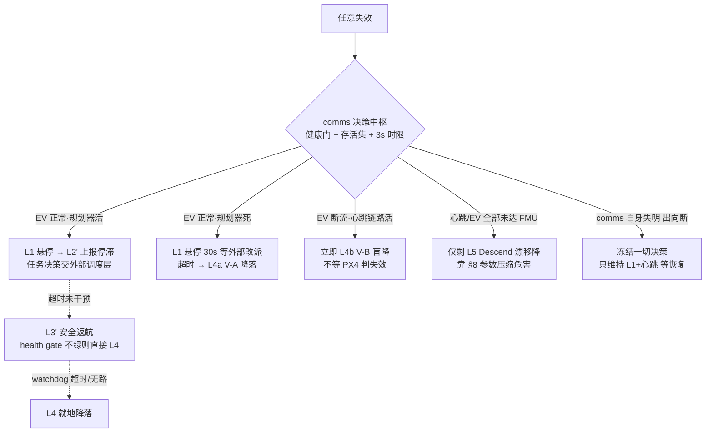

# 系统失效降级方案设计（v0.1，2026-09-18）

> 适用范围：Super-LIO + xtd2_communication + ego_planner/traj_server + uXRCE-DDS + PX4(EV-only) 全链。
> 依据：05_46_38、0914 17:57、0918 13:51 三起事件的复核结论与 `log_345` ULog 实锤。
>
> **前置假设（本版新增）**：本系统之外存在一个**任务调度层**，负责目标点下发
> （发布 `/goal_pose_3d`）与到达确认（外部自行判定）。**该模块本期不动**。
> 本文所有设计以"不侵入、不改变调度层行为"为硬约束，只在其两侧补接口。

---

## 0. 权限划分：任务权 vs 安全权

| 决策 | 归属 | 说明 |
|---|---|---|
| 去哪个点、顺序、跳过、重试 | **外部调度层** | 系统内不再建 waypoint 队列（上一版方案在此越权，已删） |
| 到达确认 | **外部调度层** | 维持现状；系统只保证"把状态如实报出去" |
| 悬停/跳点停滞的**上报** | 系统（comms） | 只报事实，不替外部做任务决策 |
| 电池红标 / LIO RED / 链路失明 时的**即时保命动作** | **系统本地** | 安全权，不等外部授权（外部响应回路太快不了 3s 时限） |
| 安全动作执行后的**再起飞闸门** | 系统本地（safety_hold） | 防止外部按到达逻辑重发 goal 把已落地的飞机再次拉起 |

原则一句话：**任务问题报告给外部，安全问题自己立即处理并广播**——
两条路的时序要求差两个数量级（任务=分钟级，安全=3 秒级），混在一起会两头误事。

## 1. 三条硬前提（决定"哪些降级存在"）

1. **EV 是唯一绝对定位源 → 悬崖效应**。EV 断流约 4~5s 后 PX4 判
   `local_position_invalid`（0918 ULog 实测），此后 Hold / Position / AUTO_LAND /
   RTL 全部不可运行，飞控端只剩 Descend（无水平控制、随风漂）。
   → **一切"需要位置"的降级动作必须在断流后 ~3s 内决策**，不存在"先等等看"。
2. **PX4 侧 RTL / AUTO_LAND 是够不着的**。无全局定位 → `home_position_invalid`
   实锤。"返航"只能是规划器侧轨迹返航；"降落"分两条腿：位置有效走 AUTO_LAND
   （V-A），位置失效只能自建盲降（V-B）。
3. **comms 是控制链单点**。它死了没有任何外部手段能救（QGC/调度层都无 offboard
   注入通道），兜底只剩 PX4 参数阶梯。因此：comms 自身防护（心跳 try/except、
   EV 限速、BE 订阅——均已落地）和 §8 参数表本身就是降级体系的一部分。

## 2. 降级阶梯（动作定义）

| 层级 | 动作 | 执行者 | 依赖 | 现状 |
|---|---|---|---|---|
| L0 | 带伤续飞（扣帧 / 跳变守卫 / BE 丢过期帧） | comms 守卫 | — | ✅ 已有 |
| L1 | 悬停保持（零速 setpoint 冻结） | comms | 位置有效才站得住 | ✅ 已有（brake/hover） |
| L2' | **goal 停滞上报**（原"跳过点"改造：报告而非决策） | comms → 外部 | — | 🆕 本文 §5/§6.1 |
| L3' | **安全返航**（任务返航归外部，见 §6.2） | planner 通道 + comms | EV+规划器+位置可信 | 🆕 |
| L4a | 原地降落 V-A（AUTO_LAND） | PX4 + comms 监护 | 位置有效 | ✅ `trigger_landing` |
| L4b | 原地盲降 V-B（速度下降 + 触地检测） | comms 直发 setpoint | 仅心跳链路 | 🆕 **全场最值钱** |
| L5 | PX4 failsafe Descend | FMU 自动 | — | ✅（漂移是模式天性） |
| L6 | 触地强制 disarm 1Hz 重试 | comms 降落监护 | 已接地 | ✅ 已有 |

## 3. 核心路由：降级动作取决于"存活集"，而非故障种类



## 4. 失效场景清单 × 检测 × 路由

✅=现有信号可直接用，🆕=需新增（均为 comms/规划侧小改动）。

### A. 感知 / LIO 链

| # | 场景 | 检测 | 路由 |
|---|---|---|---|
| A1 | LiDAR 退化（玻璃/粉尘/特征缺失） | 🆕 协方差贴 `EV_COV_*MAX` 占比、`_odom_reset_out` 速率 | YELLOW→禁返航(转L4)、上报；持续→L3'或L4b |
| A2 | LiDAR 断连/无点云 | ✅ odom `gap>0.3s`；🆕 gap>1s→RED | RED→**L4b（3s 内定夺）** |
| A3 | LIO 发散/跳变 | ✅ `_odom_jump_cnt`；🆕 速率化 N 次/30s | 1~2 次→L1 观察；频发→RED→L4b |
| A4 | LIO 进程死 | ✅ odom 全停 | 同 A2 |
| A5 | 陈旧帧/时标倒退 | ✅ stale 计数；BE 订阅后应趋零 | 成片出现→按 A2 |
| A6 | z 基准污染（baro/测距，0914 前科） | 🆕 PX4 lpos.z 与 LIO z 交叉核对，\|Δ\|>2m 告警 | L1→上报；自动兜底只有 L4b（降速压动能） |

### B. 通信链

| # | 场景 | 检测 | 路由 |
|---|---|---|---|
| B1 | uXRCE 入向断（0918：节点活着在发，FMU 收不到） | 节点**不可自见**→🆕 往返探针：0.5Hz 发幂等 `VEHICLE_CMD_USER_1`，watch `vehicle_command_ack`（✅callback 已有，改接判定） | 探针超时→广播 `LINK_OUTBOUND_DEAD`；机载无法自救→真兜底=§8 的 `COM_OF_LOSS_T=2` + `COM_OBL_RC_ACT`（位置有效→Hold） |
| B2 | agent 崩 | 同 B1 | 同 B1 |
| B3 | 心跳降频（executor 饥饿） | 🆕 自检 timer 实频<10Hz 告警（stats ✅） | 限速已缓解大半；持续→上报，地面改派 L4a |
| B4 | 出向断（FMU→节点，comms"失明"） | 🆕 vehicle_status/vehicle_odometry 到达 watchdog（>2s 无） | **最阴险**（会基于陈旧状态乱动作）→立即冻结决策、只维持 L1+心跳、广播 `LINK_BLIND` |

### C. 规划 / 任务层

| # | 场景 | 检测 | 路由 |
|---|---|---|---|
| C1 | traj_server/planner 死 | ✅ `cmd_trajectory_flu` 断流（8.8Hz 基线） | 位置有效→L1 悬停 30s（等外部改派）→超时 L4a。**绝不自动 V-B**（位置好没必要赌） |
| C2 | goal 不可达/无进展（0918 实况：收 goal 后悬停 56s） | 🆕 goal 进展 watchdog：预算 `T_goal` 内距 goal 距离无净下降 | **L2' 上报 GOAL_STALLED**，任务决策交外部；超时无干预→L3'（安全返航）→L4 |
| C3 | 轨迹求解反复失败 | 🆕 traj_server 失败/时间预算耗尽计数（随 status 带出） | 同 C2 |
| C4 | 坏 goal（越界/地下/超远） | 🆕 comms 入链前合法性检查 | 拒绝+上报 `GOAL_REJECTED`，不触发 auto-switch |
| C5 | 起飞序列卡住（arm/takeoff ack 丢失） | ✅ ack callback 现成，🆕 接超时判定 | 放弃起飞→disarm→IDLE→上报 |

### D. 电源 / 环境 / FMU

| # | 场景 | 检测 | 路由 |
|---|---|---|---|
| D1 | 电量黄（建议返航线） | 🆕 comms 目前**没有** battery 订阅，第一块缺口 | 上报 `BATTERY_WARN`；等外部改派返航，`T_ext` 无干预→本地 L3' |
| D2 | 电量红（保底线）/电压急坠 | 🆕 阈值+下降速率 | 不等外部：L4a（位置有效）/L4b（临界） |
| D3 | 板卡过热 | ✅ >86°C 已有降落 | 已有 |
| D4 | FMU 空中重启（brownout/hardfault） | **软件无解**（0526 类） | 只能硬件缓解（飞控独立供电/大容量电容）；如实标注 |
| D5 | IMU/执行器失效 | FMU failure_detector 自理 | 不介入 |

### G. 人工阀

| # | 场景 | 问题 | 建议 |
|---|---|---|---|
| G1 | 无人工接管通道 | `COM_RC_IN_MODE=3` 禁摇杆，QGC 又被 offboard 链路牵制 | RC 三段开关→DDS 转发进现有 command service：HOVER / LAND（kill 慎用）。属本机自身改动，不涉调度层 |

## 5. 与外部调度层的接口契约（本期新增的唯一"协议面"）

外部调度层**零改动**也可运行（它继续发 `/goal_pose_3d`、按自己的方式确认到达）；
以下接口是**系统单方面广播**，外部将来按需接入即可。

### 5.1 `goal_seq`（目标代次）
comms 每收到一个新 `/goal_pose_3d`，`goal_seq += 1`（本机打戳，不改外部消息）。
所有状态上报携带 `goal_seq`，外部可用它对齐"我说的是哪一个目标的事"。

### 5.2 `/mission_status`（`std_msgs/msg/String`，JSON，1Hz+事件即发）

```json
{
  "goal_seq": 12,
  "state": "EXEC | HOVER | STALLED | RETURNING | LANDING_VA | LANDING_VB |
            LANDED | SAFETY_HOLD | LINK_BLIND | LINK_OUTBOUND_DEAD | IDLE",
  "reason": "GOAL_NO_PROGRESS_90S | BATTERY_WARN | LIO_RED | PLANNER_DEAD | ...",
  "dist_goal": 4.21,
  "alt": 4.14,
  "battery": {"pct": 31.2, "warn": false},
  "lio": "GREEN | YELLOW | RED",
  "ts": 1789710709.1
}
```
- 状态变化立即发布；稳态 1Hz 心跳式（外部可用来检测 comms 存活）。
- **`state` 是全序的**：外部若只订阅这一个 topic 即可看懂飞机在干什么。

### 5.3 `safety_hold` 再起飞闸门（头号协作风险的解）
现状：任何 `/goal_pose_3d` 会走 auto arm→takeoff→offboard 全自动。
若系统本地执行了 L3'/L4（安全返航/降落）而外部按原到达逻辑重发下一个 goal，
**会把已落地的飞机再次拉起**。规则：

1. 任何**本地安全动作**（L3'/L4a/L4b/B1~B4 触发）一旦执行 → `safety_hold=True`；
2. hold 期间：goal 到达一律**不转发 planner、不触发 auto-switch**，只回
   `SAFETY_HOLD` 状态（外加一条显式拒绝日志）；
3. 解除条件（二选一）：
   - 外部干预：调用现有 command service 新增的 `RESET_HOLD`（或后续外部接
     status 后按其节奏确认）；
   - 飞机已 disarm 且人工重启节点（保底路径，不依赖外部）。
4. **任务类上报（GOAL_STALLED 等）不进 hold**——那是给外部决策的信息，
   外部改派新 goal 时按正常流程走（自动清 hold 不适用，本来就无 hold）。

### 5.4 宽限期 `T_ext`（安全动作等不等外部）
- 电量黄、goal 停滞：**先上报，等 `T_ext=30s`**（可参）无新 goal/无干预 → 本地
  安全动作接管（L3'→L4）。
- LIO RED、电量红、触地前兆：**不等**，立即执行。3 秒时限来自 §1.1，物理性质，
  协议改不了。

## 6. 三大动作具体设计（修订版）

### 6.1 原"跳过目标点" → **goal 停滞上报（L2'）+ 安全接管**
- 删除原设计中的系统内 waypoint 队列与本地"跳到 next"逻辑（任务权归外部）。
- 实现：comms 内 goal 进展 watchdog（`T_goal` 默认 90s；进展判据=期间
  `dist(goal)` 最值无净下降超过 `min_progress`，且飞机确实在动——用 LIO 速度
  区分"卡住"与"已到达但外部没确认"）。
- 触发 → 发 `STALLED` + `reason`，同时执行 **L1 悬停**（安全默认态，位置有效时
  代价最小）；此后进入 §5.4 宽限流程。
- "已到达但外部未确认"的区分很重要：若 `dist<外部到达阈值(0.5m)` 而外部迟迟不发
  下一 goal，本系统只报 `ARRIVED_UNACK`，**永不自行离场**（到达点附近乱动最危险）。

### 6.2 原"返航" → **安全返航（L3'）**
- 定位收窄：**任务返航 = 外部直接下发 home 点作为普通 goal**——系统零开发、零
  判定，天然被外部节奏控制。本节只做"外部不可信/未响应时"的安全返航。
- home：起飞完成（auto_switch 结束）时快照 LIO odom FLU `(0,0,0)` 与 PX4 lpos
  换算对（`init_vehicle_local_position` 已在手），存 `self.home_pose`。
- 触发：D1 黄电量超宽限 / C2 停滞超宽限 / A1 YELLOW 持续。
- **硬前提（health gate GREEN 全绿）**：odom 新鲜 + 协方差未贴顶 + reset 不频发 +
  z 交叉核对通过；任一不满足 → 降级 L4（漂移的 LIO 系里"home"本身就是未知数）。
- 航线两段化：goal=`(home.x, home.y, h_return)` → 到位后 goal=`(home.x, home.y,
  0.8m)` → 触底转 L4a。全程 `RETURNING` 上报。
- 返航 watchdog：每段独立 `T_goal`，超时/无路 → 就地 L4（不回头）。
- **禁用 `VEHICLE_CMD_NAV_RETURN_TO_LAUNCH`**（现有 `rtl()`）：本机永远不可达
  （无 global/home），保留只会造成操作员虚假安全感。改为内部实现 = L3'，或删除。

### 6.3 原地降落（L4）—— V-A 已有，**V-B 盲降新建**
- **V-A（位置有效）**：现成 `trigger_landing()`→AUTO_LAND→既有降落监护。不动。
- **V-B（EV 已死/将死、心跳链路活）状态机 `LAND_IN_PLACE`**：
  1. 进入条件：health gate RED（gap>1s / 10s 内 ≥3 跳变 / 协方差连续贴顶 2s）；
     或 C1/B4 的"位置尚有效但等待放弃"超时后**降级进入**（若届时位置仍有效则先走 V-A）。
  2. `velocity=[0,0,0]` 悬停 2s（趁 PX4 lpos 还没判死，还站得住）。
  3. 混合 setpoint：`position=[x,y,*]`（锁最后水平位置）+ `velocity_z=+0.4m/s`
     （NED 下正）下降；**心跳全程保持**，避免 PX4 抢先 offboard-loss→Descend。
  4. 触地判定：复用 `_is_on_ground` / 高度 / 速度信号。
  5. 触地后：`OFFBOARD_STATE=DISABLED` + `LANDING_VB→LANDED` 上报 + 既有
     1Hz 强制 disarm 兜底 + `safety_hold=True`。
- 承认的风险：盲降对脚下无障碍感知；0.4m/s 限速压动能；**只应在已知净空区
  （起飞点正上方航线）信任它**，这是它排在 V-A 之后的原因。
- **RED 时禁止发 EV-NaN 关通道**：EV 全 NaN = 主动引爆 position invalid，
  把 4.5s 决策窗口瞬间清零。RED 的语义是"停止信任+立即降落序列"，不是"告诉
  飞控别融合"（那属于硬件级弃飞，本体系没有这个档位）。

## 7. LIO health gate（所有安全决策的公共前提）

全部输入都是现成计数器，只差每 tick 一次的汇总函数：

| 等级 | 条件（任一） | 允许 | 禁止 |
|---|---|---|---|
| GREEN | stale/jump/cov 均静默 | L1~L4b 全部 | — |
| YELLOW | 单帧 stale；≤2 跳变/30s；协方差短时贴顶 | L1、L2'、L4a | **L3' 返航**（home 可能不可信）、新 goal 转发需带提醒上报 |
| RED | gap>1s；≥3 跳变/10s；协方差连续贴顶 2s；odom 全停 | **只有 L4b 与 L1(短)** | 其余一切 |

## 8. PX4 参数兜底（与软件层并列，缺一不可）

| 参数 | 现值 | 建议 | 理由 |
|---|---|---|---|
| `COM_OF_LOSS_T` | **60** | 2 | log_345 实锤：心跳断供 60s 才判 lost，全靠 position invalid 连带触发（+4.5s）。位置有效时的断链（如 B1 变体）会挂 60 秒 |
| `COM_OBL_RC_ACT` | 4 | 位置可保持类动作（Hold/Position） | 入向断时飞控端唯一自动防线；本机 Hold 不可用时 PX4 自动逐级 fallback，配它不亏 |
| `COM_QC_ACT` / `COM_FLTT_LOW_ACT` | Return 系 | Land | 无全局定位，Return 永不可达（§16 H3 旧结论） |
| `MPC_Z_VEL_MAX_DN` | 1.0 | 0.7 | 压低 L5 漂移下降动能 |
| `EKF2_EV_* / OF / GPS` | 已定档 | 维持 | 0918 证明参数体系无罪 |

## 9. 实施顺序（含验收）

| 阶段 | 内容 | 主要落点 | 验收 |
|---|---|---|---|
| P0 | §8 参数 | QGC | 台架拔线测试：位置有效时断心跳 ≤3s 进 Hold |
| P1 | V-B 盲降 + safety_hold + `goal_seq` + `/mission_status` 骨架 | comms 单文件 | 系绳台：手动杀 LIO → ≤3.5s 自动进入 V-B 并受控落地、hold 生效、外部重发 goal 不被执行 |
| P2 | battery 订阅 + D1/D2 阈值 | comms | 回放/实拔验证黄红两档 |
| P3 | health gate 三色（汇总现有计数器） | comms | 日志核对三档切换 |
| P4 | C2 goal 进展 watchdog + L2' 上报 + T_ext 宽限 | comms | 复演 0918"悬停 56s"场景 → 90s 内 STALLED 上报、外部可见 |
| P5 | L3' 安全返航 | comms+复用 planner | 场地：中段杀规划器→返航或就地降落二选一正确 |
| P6 | B1 往返探针 + B4 失明 watchdog + G1 RC 阀 | comms | 断 agent：广播 `LINK_OUTBOUND_DEAD`；断出向：节点冻结不乱动 |
| P7 | 归档/迭代 | 本文 | — |

P1 是安全净收益最大的一步（覆盖 A2/A3/A4/D2 四类高频场景的受控落地），
P4/P5 是协作正确性的关键（0918 的"悬停 56s 无事发生"暴露的正是上报缺失）。

## 10. 明确不做 / 边界

1. **不动外部调度层**：不替它做跳过/重试/到达判定；只广播状态供其消费。
2. **系统内不建 waypoint 队列**（与调度层职责重复）。
3. **不使用 PX4 RTL / 不假装可达 AUTO_RTL**；`rtl()` 待改绑或删除。
4. **RED 不用 EV-NaN 关通道**（§6.3）。
5. **FMU 空中重启软件不可救**（D4），归硬件整改。
6. 不引入新 msg 包：`/mission_status` 用 `std_msgs/String`+JSON，接口最小化。

## 11. 下次飞行核对清单（ULog + 节点日志）

- [ ] `vehicle_visual_odometry` 入流 ≈20Hz、无 >0.2s 空洞（EV 限速已生效）
- [ ] `timesync_status` 1Hz 全程不中断（入向链路健康）
- [ ] 节点 stats：`ros2_odom_callback` avg_time 显著低于 6.2ms、timer 恢复 20Hz
- [ ] `/mission_status` 1Hz 可达（`ros2 topic echo`）
- [ ] 若再现 GOAL_STALLED：确认外部调度层在 T_ext 内的响应行为符合预期
- [ ] `COM_OF_LOSS_T`/`COM_QC_ACT` 生效值复核（parameter_update 快照）
